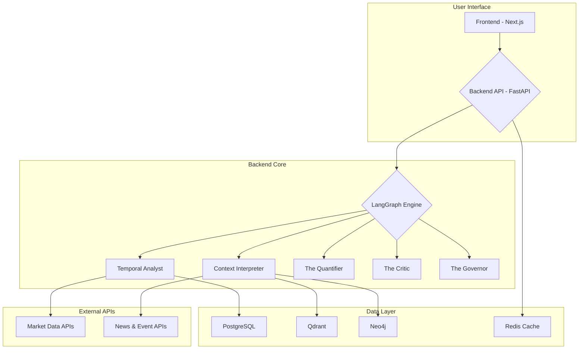

# Zarqa al Yamama - Developer Guide

**Version:** 1.0.0  
**Creator:** Qusai Al-Duaij  
**Last Updated:** 2025-02-17

---

## 1. Introduction

This document provides a comprehensive technical overview of the **Zarqa al Yamama** system for developers. It covers the system architecture, development environment, codebase structure, and guidelines for extending the system.

### 1.1. Target Audience

This guide is intended for software developers, AI engineers, and system architects who are responsible for maintaining, extending, or integrating with the Zarqa al Yamama platform.

### 1.2. Technology Stack

A foundational understanding of the following technologies is recommended:

| Area | Technology | Version |
| :--- | :--- | :--- |
| **Backend** | Python, FastAPI, LangGraph | 3.11+ (Strict) |
| **Frontend** | TypeScript, Next.js, React | 18+, 14+ |
| **Databases** | PostgreSQL, Qdrant, Neo4j, Redis | 15+, 1.7+, 5+, 7+ |
| **Deployment** | Docker, Docker Compose | 20.10+ |

---

## 2. System Architecture

Zarqa al Yamama is a containerized monorepo application composed of a Python backend (Locked to 3.11), a Next.js frontend, and a suite of specialized databases.

### 2.1. High-Level Diagram



### 2.2. Backend Architecture (`/backend`)

The backend is a FastAPI application that serves as the core orchestration layer.

-   **`app/main.py`**: The main entry point of the FastAPI application. It defines API routes, middleware (for `X-Powered-By` headers), and the application lifecycle.
-   **`app/graph/`**: Contains the LangGraph orchestration logic. This is the heart of the AI system.
-   **`app/agents/`**: Home to the five specialized AI agents. Each agent is a self-contained module responsible for a specific task.
-   **`app/db/`**: Manages connections and interactions with the four databases.
-   **`app/config.py`**: Handles environment variable loading and application configuration.
-   **`app/integrations/`**: Contains clients for interacting with external APIs (e.g., GDELT, NewsAPI).

### 2.3. Frontend Architecture (`/frontend`)

The frontend is a Next.js application providing the user interface.

-   **`app/page.tsx`**: The main page component that contains the UI for generating and displaying forecasts.
-   **`lib/api.ts`**: A TypeScript client for making requests to the backend API. It includes type definitions for API responses.
-   **`components/`**: Reusable React components used to build the UI.
-   **`styles/`**: Global CSS and Tailwind CSS configuration.

---

## 3. The LangGraph Workflow

The core of Zarqa al Yamama's intelligence is its multi-agent system, orchestrated by **LangGraph**. LangGraph allows us to define the forecast process as a stateful graph where each node is an agent and edges determine the flow of control.

### 3.1. The State Object (`app/graph/state.py`)

The `ForecastState` is a TypedDict that represents the shared memory of the graph. It is passed between agents, with each agent reading from and writing to it. It contains over 30 fields, including:

-   `scenario`: The user-defined scenario.
-   `base_forecast`: The output from the Temporal Analyst.
-   `sentiment_score`: The output from the Context Interpreter.
-   `final_prediction`: The adjusted forecast from The Quantifier.
-   `validation_status`: The result from The Critic.
-   `ethical_status`: The result from The Governor.
-   `citation_chain`: A list of all data sources used.

### 3.2. The Graph Definition (`app/graph/workflow.py`)

The `ZarqaWorkflow` class defines the structure of the agent graph:

1.  **Nodes**: Each of the five agents is defined as a node in the graph.
2.  **Entry Point**: The graph starts with the `Temporal Analyst` and `Context Interpreter` running in parallel.
3.  **Conditional Edges**: After the initial analysis, the graph proceeds to `The Quantifier`.
4.  **Sequential Flow**: From The Quantifier, the state flows sequentially through `The Critic` and finally `The Governor`.
5.  **Compilation**: The graph is compiled into a runnable `LangGraph` object.

```python
# Simplified graph definition from workflow.py
workflow = StateGraph(ForecastState)

# Add agent nodes
workflow.add_node("temporal_analyst", temporal_analyst_node)
workflow.add_node("context_interpreter", context_interpreter_node)
# ... add other nodes

# Define the flow
workflow.set_entry_point("temporal_analyst")
workflow.add_edge("temporal_analyst", "context_interpreter")
workflow.add_edge("context_interpreter", "quantifier")
# ... define rest of the flow

# Compile the graph
app = workflow.compile()
```

---

## 4. The Agents (`app/agents/`)

Each agent is a Python function that takes the `ForecastState` as input and returns a dictionary with the fields it has modified.

#### `temporal_analyst.py`
-   **Purpose**: Analyzes structured, time-series data.
-   **Process**: 
    1. Fetches historical market data from a financial API (e.g., Polygon.io).
    2. (Future) Feeds data into an AutoML tool like H2O.ai for regression.
    3. In the current version, it generates a mock forecast with random noise.
    4. Populates `base_forecast` and `confidence` in the state.

#### `context_interpreter.py`
-   **Purpose**: Analyzes unstructured text data for sentiment and themes.
-   **Process**:
    1. Fetches recent news articles from GDELT or NewsAPI related to the scenario.
    2. Calculates a sentiment score for the collected text.
    3. (Future) Identifies key actors and events and maps them into the Neo4j knowledge graph.
    4. Populates `sentiment_score` and `key_themes` in the state.

#### `quantifier.py`
-   **Purpose**: Fuses the outputs of the temporal and context agents.
-   **Process**:
    1. Reads `base_forecast` and `sentiment_score` from the state.
    2. Applies the mathematical formula: `Final = Base * (1 + (Sentiment * Risk_Weight))`.
    3. Populates `final_prediction` in the state.

#### `critic.py`
-   **Purpose**: Validates the data sources and analysis.
-   **Process**:
    1. Checks the sources in the `citation_chain` against a pre-defined "Safe List" (`APPENDIXA.docx`).
    2. Assigns a data quality score.
    3. Populates `validation_status` (`APPROVED` or `FLAGGED`) in the state.

#### `governor.py`
-   **Purpose**: Ensures ethical compliance and tracks lineage.
-   **Process**:
    1. Reviews the forecast for potential ethical violations (e.g., market manipulation).
    2. Finalizes the `citation_chain`.
    3. Sets the `X-Powered-By` header.
    4. Populates `ethical_status` (`APPROVED` or `REQUIRES_REVIEW`) in the state.

### 4.1. The ExplainFusion Boundary (Wall of Separation)
> **Rule:** Operational Agents describe the *What*; ExplainFusion describes the *How*.

To prevent schema drift and narrative hallucination, the following boundary is strictly enforced:

*   **Operational Agents** (Temporal, Context, etc.) are **FORBIDDEN** from:
    *   Assigning their own weights.
    *   Declaring their own "independence" (this is a relative metric).
    *   Filling `ExplainFusion` fields (e.g., `penalty_rationale`).
*   **The Quantifier** (ExplainFusion) is **FORBIDDEN** from:
    *   Generating new claims or evidence.
    *   Writing creative fiction/narratives (must only synthesize).

---

## 5. Development Environment

### 5.1. Backend Setup

1.  Navigate to the `/backend` directory.
2.  Create a Python virtual environment: `python3 -m venv venv`
3.  Activate it: `source venv/bin/activate`
4.  Install dependencies: `pip install -r requirements.txt`
5.  Copy `.env.example` to `.env` and fill in your API keys.
6.  Run the development server: `uvicorn app.main:app --reload`

The API will be available at `http://localhost:8000`.

### 5.2. Frontend Setup

1.  Navigate to the `/frontend` directory.
2.  Install dependencies: `npm install`
3.  Run the development server: `npm run dev`

The web interface will be available at `http://localhost:3000`.

### 5.3. Running Tests

The test suite uses `pytest`.

1.  Navigate to the `/backend` directory.
2.  Run the tests: `pytest`

---

## 6. Extending the System

The modular architecture of Zarqa al Yamama makes it easy to extend.

### 6.1. Adding a New Agent

1.  **Create the Agent File**: Create a new Python file in `app/agents/` (e.g., `my_new_agent.py`).
2.  **Define the Agent Function**: Write a function that accepts `state: ForecastState` and returns a dictionary of the state fields it modifies.
3.  **Add a Node to the Graph**: In `app/graph/workflow.py`, import your new agent and add it as a node to the `StateGraph`.
4.  **Update the Edges**: Modify the graph edges to include your new agent in the desired position in the workflow.
5.  **Update the State**: If your agent adds new information, add the corresponding field to the `ForecastState` TypedDict in `app/graph/state.py`.

### 6.2. Adding a New API Endpoint

1.  **Define the Route**: In `app/main.py`, add a new FastAPI route decorator (e.g., `@app.get("/api/v1/my-new-route")`).
2.  **Create the Handler Function**: Write the asynchronous function that will handle requests to this route.
3.  **Define Pydantic Models**: If the route accepts a request body or returns a complex response, define the corresponding Pydantic models for validation and serialization.
4.  **Update the Frontend**: In `frontend/lib/api.ts`, add a new function to call your new endpoint.

### 6.3. Adding a New Scenario

1.  **Update the Frontend**: Add the new scenario name to the dropdown list in `frontend/app/page.tsx`.
2.  **Implement Backend Logic**: The backend agents (especially the `Temporal Analyst` and `Context Interpreter`) need to be updated to handle the new scenario. This may involve:
    -   Pointing to a new data source.
    -   Using different keywords for news searches.
    -   Applying a different forecasting model.

---

## 7. Code and Project Structure

```
zarqa-al-yamama/
├── backend/                # FastAPI Backend
│   ├── app/
│   │   ├── agents/         # Agent implementations
│   │   ├── db/             # Database clients
│   │   ├── graph/          # LangGraph workflow
│   │   ├── integrations/   # External API clients
│   │   ├── config.py       # Configuration loading
│   │   └── main.py         # FastAPI app entry point
│   ├── tests/              # Pytest test suite
│   ├── requirements.txt    # Python dependencies
│   └── Dockerfile          # Backend container image
├── frontend/               # Next.js Frontend
│   ├── app/                # Next.js pages and layout
│   ├── components/         # Reusable React components
│   ├── lib/                # API client library
│   └── Dockerfile          # Frontend container image
├── docker-compose.yml      # Docker infrastructure definition
├── install.sh              # Linux/macOS installer
├── install.ps1             # Windows installer
└── *.md                    # Documentation files
```

---

## 8. Support

For technical questions or contributions, please refer to the project's official repository or contact the lead developer, **Qusai Al-Duaij**.
