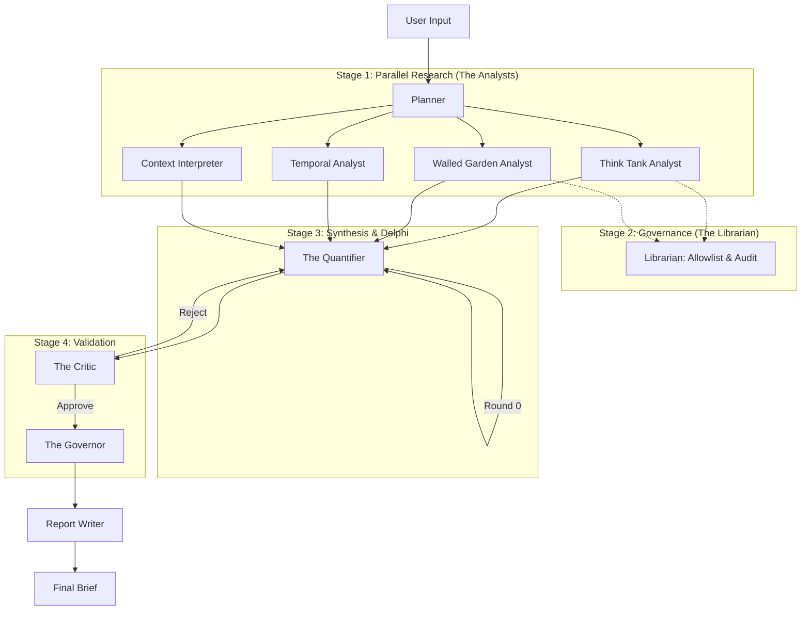

# Zarqa al Yamama: System Audit & Gap Analysis

**Date:** 2025-12-25
**Auditor:** Anti-Gravity Agent
**Mode:** AUDIT-ONLY
**Subject:** Architecture Comparison vs. Open Deep Research

---

## 1. Executive Summary

Zarqa al Yamama (ZAY) is currently architected as a **governed, parallel-processing forecasting engine** rather than a recursive deep research system. It excels at **structured quantification** and **strict source governance** (The Librarian), but lacks the **iterative depth** and **recursive query expansion** characteristic of Open Deep Research (ODR) patterns.

**Verdict:** The system should **EVOLVE** to incorporate recursive depth within its analyst nodes while maintaining its superior governance and quantification layer.

---

## 2. "As-Is" Architecture

The current system utilizes a **Map-Reduce** pattern with a constrained **Critique Loop** (Stateful Graph).

### 2.1 Backend Orchestration (`app/workflow.py`)
- **Framework:** LangGraph (StateGraph)
- **Topography:** Static Parallel Execution with Convergence.
- **Components:**
    1.  **Planner:** Decomposes request (Prompt A).
    2.  **Analysts (Parallel):** `Temporal`, `Context`, `ThinkTanks`, `Political`, `WalledGarden`, `Market`.
    3.  **Synthesis (Reduce):** `TheQuantifier` (Fuses signals, explicitly calculates P10/P90).
    4.  **Validation (Loop):** `TheCritic` -> if REJECT -> `TheQuantifier` (Max 2 Rounds).
    5.  **Oversight:** `TheGovernor` -> `ReportWriter` (Decision Brief).

### 2.2 Input/Output Flow
- **Frontend:** Next.js Client -> POST `/forecast` -> Polls Output.
- **Reporting:** Structured Markdown/Text (PDF currently disabled).

### 2.3 ASCII Architecture Diagram

---

## 3. Comparison: ZAY vs. Open Deep Research

**Open Deep Research (ODR) Pattern:**
Typically follows: *Generate Plan -> Execute Recursive Search -> New Questions -> Refine Plan -> Execute -> Synthesize.*

**ZAY Pattern:**
Follows: *Fixed Plan -> One-Shot Safe Search -> Math/LLM Synthesis -> Critic Check -> Result.*

### Gap Analysis Table

| Feature | Open Deep Research (ODR) | Zarqa al Yamama (ZAY) | Gap / Assessment |
| :--- | :--- | :--- | :--- |
| **Research Depth** | Recursive (Depth N). Follows citation trails. | One-Shot (Depth 1). Fetches top K results once. | **CRITICAL GAP**: ZAY misses "down the rabbit hole" insights. |
| **Query Flexibility** | Dynamic. Generates new queries based on findings. | Static. Determined at start by Planner. | **GAP**: Unable to pivot if initial search yields noise. |
| **Source Governance** | Variable (often broad crawl). | **Strict (The Librarian)**. Allowlist Only. | **ZAY ADVANTAGE**: Immune to SEO spam/untrusted sources. |
| **Synthesis** | LLM-based narrative summary. | **TheQuantifier**. Explicit P10/P50/P90 math. | **ZAY ADVANTAGE**: Decision-grade numerical rigor. |
| **Consensus** | Single pass aggregation. | **Delphi Protocol**. Recursive arbiter loop. | **ZAY ADVANTAGE**: Better handling of conflicting data. |
| **Auditability** | Varies. | **High**. Hash-verified content cleaning. | **ZAY ADVANTAGE**: Enterprise-ready compliance. |

---

## 4. Decision Report

### What to Adapt (Keep & Polish)
1.  **The Librarian:** This is the system's "moat." Do not weaken it to match ODR. The strict allowlist is essential for "Decision-Grade" trust.
2.  **The Quantifier:** The separation of Math (P10/P90) from Narrative is superior to pure LLM synthesis. Keep this logic.
3.  **Prompt Engineering:** The current Prompt A-E pipeline is robust and produces high-quality structured output.

### What to Ignore (Do Not Copy)
1.  **Ungoverned Crawling:** ODR often scrapes the broad web. ZAY must remain restricted to the Walled Garden.
2.  **Unbounded Recursion:** ODR can run for hours. ZAY requires reasonable interactive latency (minutes, not hours).

### What to Evolve (The Upgrade Path)
To bridge the gap to "Deep Research" without losing governance:

1.  **Recursive Analyst Nodes:**
    *   *Current:* `WalledGardenAnalyst` runs one search.
    *   *Target:* `WalledGardenAnalyst` becomes a **Subgraph**.
    *   *Logic:* Search -> Read -> Is Sufficient? -> If No, generate new query (from findings) -> Search Again. (Max Depth = 3).
2.  **Dynamic Planner Update:**
    *   Allow the `Planner` to receive feedback from Analysts andissue new "Research Orders" mid-stream.
3.  **Citation Graphing:**
    *   Implement logic to explicitly trace citations found in `ThinkTank` reports and feed them back to `Librarian` for verification.

## 5. Conclusion

Zarqa al Yamama is a robust **Forecasting Machine** but a shallow **Researcher**. To achieve true "Open Deep Research" capabilities, we must implement **Recursive Subgraphs** within the Analyst nodes. This will allow the system to "think" and "dig" rather than just "retrieving" and "computing."
